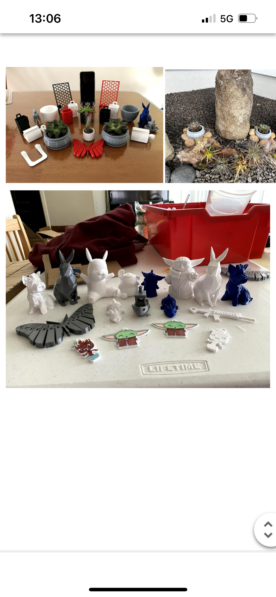

  

The 3D Printer Program through NexTech Hawaii is a 6-week program to teach families in Hawaii to use a 3D printer. The 3D printers are provided for free along with the filaments during the 6-week program until the printer is passed off onto another family during the next program round. The program targets families with young children who are interested in 3D Printing.

I created the 6-week curriculum, coordinated family participation and printer transfers, and solved questions/issues through Discord. I also conducted initial zoom meetings with the families to set up expectations of paperwork and required printing logs. After every week of the program, I wrote a weekly report and filed them in the program folder for NexTech Hawaii to access. I started this program during the COVID-19 pandemic.

I learned program development, coordination, and management throughout this program. In starting the creation of the program, I learned to be patient and put in the work to create a program, create curriculum, and learn how to solve printer issues. Most importantly, I learned to delegate tasks and work for my student helpers.

You can learn more at the [NexTech Hawaii 3D Printing](https://www.nextechhawaii.org/3d-printing).
