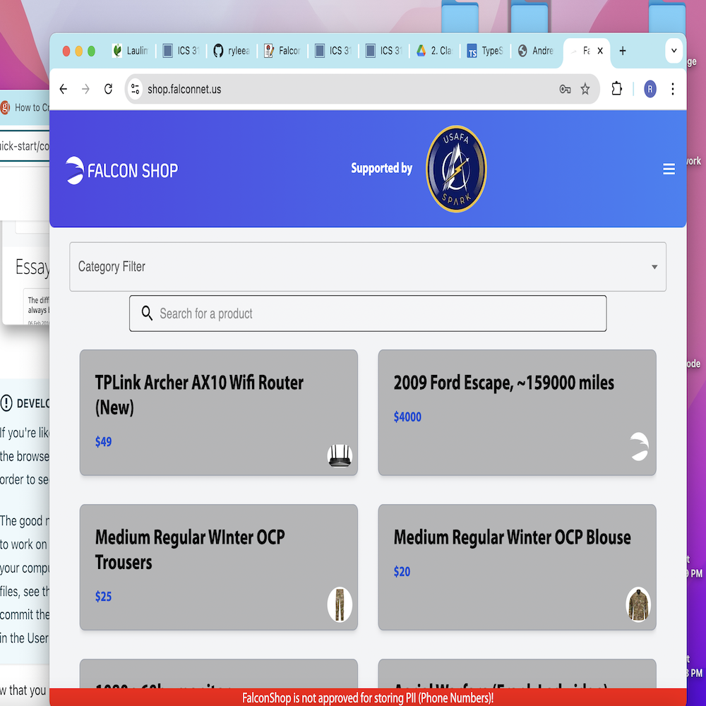

  

The Falconnet Shop is a buying and selling website for the 4,000+ cadets at the United States Air Force Academy. Cadets can create an account, post items to sell with a picture, view their own listings, delete their own listings, and view all listings. In addition, all of the listings can be filtered with a search bar or category filter. Cadets are also able to provide feedback back to the team for further development.

For this project, I was a programmer responsible for completing delegated tasks. My team often practiced peer programming for maximum efficiency during our meetings twice a week. Some of my contributions to the website include the category filter, validations for topics in making a post, and visual graphics. The validations include making sure that the price and quantities are a number and displaying an error message otherwise.

Throughout this project, I learned peer programming, website development and maintenance, and contributive teamwork. Website management is constant and I am excited to continue this project throughout my remaining years before I graduate from the institution.

You can learn more at the [Falconnet Shop.](https://shop.falconnet.us/).
